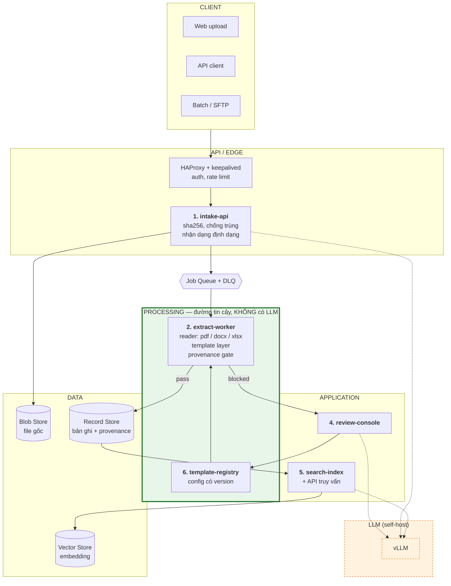

# Kiến trúc hệ thống — Document Extraction Platform

Tài liệu thiết kế kiến trúc. Phiên bản 1.0 — 10/09/2026.

## 1. Mục tiêu

Từ file **PDF / DOCX / XLSX**, lấy ra JSON có cấu trúc, **đảm bảo nội dung đúng với file gốc**.

Cam kết này gồm hai phần độc lập, mỗi phần có cơ chế và cách đo riêng:

| | Cam kết | Đo được? | Cơ chế |
|---|---|---|---|
| **A** | **Không mất chữ** — mọi ký tự trong file có mặt trong output | Có — 100,00%, đo tự động trên từng tài liệu | Tra bảng font `ToUnicode` / đọc XML. Là **tra bảng xác định**, không phải nhận dạng. |
| **B** | **Không gán sai** — mỗi giá trị nằm đúng field của nó | Có — trong phạm vi template đã đăng ký | Cổng nguồn gốc: mỗi giá trị phải chứng minh được xuất xứ trong file gốc |

### Nguyên tắc nền: fail closed

Hệ thống **không đoán**. Khi không chứng minh được một giá trị, nó trả về trạng thái `blocked` kèm lý do cụ thể, chứ không trả về một giá trị có thể sai.

> Một hệ thống "đúng 99%" mà **không biết 1% sai nằm ở đâu** thì vẫn buộc phải kiểm tay lại toàn bộ — tức không tiết kiệm được gì cho nghiệp vụ liên quan đến tiền.
>
> Một hệ thống đúng 100% trên 90% tài liệu và **tự tuyên bố không xử lý được** 10% còn lại thì dùng được ngay: 90% đi thẳng vào hệ thống, 10% vào hàng đợi cho người xử lý.

Vì vậy chỉ số cam kết **không** đặt là "độ chính xác 99%", mà là:

| Chỉ số | Cam kết |
|---|---|
| `silent_wrong` — giá trị sai lọt ra mà không ai biết | **0** |
| `automation_rate` — % tài liệu xử lý xong không cần người | đo và cải thiện theo từng template |
| `blocked_rate` theo template · `p95_latency` | theo dõi liên tục |

## 2. Kiến trúc



Đường liền = dữ liệu trong đường tin cậy. Đường gạch = gọi LLM, **luôn ở ngoài tầng PROCESSING**.

### 2.1. Sáu service

| Service | Trách nhiệm | Đặc tính |
|---|---|---|
| **1. `intake-api`** | Nhận file, tính sha256, chống trùng, lưu file gốc, đẩy job. Trả `doc_id` ngay. | Stateless, mở rộng theo request. Chỉ đọc **chữ ký byte** để nhận dạng định dạng — **không mở nội dung file**, vì parser tài liệu là bề mặt tấn công. |
| **2. `extract-worker`** | Toàn bộ đường tin cậy: reader → template → cổng bảo đảm | CPU-bound, mở rộng theo độ sâu queue. Chạy trong **sandbox không có kết nối ra ngoài**, giới hạn RAM/CPU/thời gian. |
| **3. `record-store`** | Lưu bản ghi bóc tách + provenance, phát event | Append-only, là source of truth. Không bao giờ dựng lại từ đầu. |
| **4. `review-console`** | Hàng đợi `blocked`/`needs_review`, người xem JSON cạnh file gốc | Có người trong vòng lặp. |
| **5. `search-index`** | Chunk + embedding + vector, tiêu thụ event | Dựng lại được bất cứ lúc nào. Đổi mô hình embedding không chạm tới record-store. |
| **6. `template-registry`** | Định nghĩa template, có version | Là **config trong git**, không phải dữ liệu trong DB — xem 2.3 |

### 2.2. Ba reader nằm trong **một** service

pdf / docx / xlsx là ba **module** bên trong `extract-worker`, không phải ba service riêng:

```
extract-worker
├── readers/            ← plugin theo định dạng, thay được, thêm được
│   ├── pdf_reader      (pdfplumber + pypdf + poppler)
│   ├── docx_reader     (OOXML word/document.xml)
│   └── xlsx_reader     (openpyxl + LibreOffice headless)
├── template_layer/     ← DÙNG CHUNG, đúng một bản
└── provenance_gate/    ← DÙNG CHUNG, đúng một bản
```

Định dạng file là phần **khác nhau ít nhất** giữa ba nhánh. Phần phải giống nhau tuyệt đối là *định nghĩa thế nào là đúng*. Giữ một bản duy nhất của tầng template và cổng nguồn gốc cho hai kết quả:

- **Cùng một tài liệu ở hai định dạng phải ra cùng một JSON.** Đây là phép kiểm mạnh nhất của hệ thống — hai tầng đọc hoàn toàn độc lập đối chứng nhau — và nó chỉ tồn tại khi các reader nằm trong cùng một tiến trình. Phép kiểm này đã chạy và đạt trên tài liệu mẫu.
- **Thêm định dạng mới về sau không làm phát sinh định nghĩa "đúng" thứ hai.**

Bên tiêu thụ JSON không cần biết đầu vào là định dạng gì.

### 2.3. Template là code, không phải dữ liệu

Một thay đổi template làm đổi output của **mọi tài liệu về sau**. Vì vậy template được lưu như file cấu hình có version trong git, không phải bản ghi trong database:

| | |
|---|---|
| Có review, có lịch sử, có người chịu trách nhiệm | mỗi thay đổi là một pull request |
| **CI chạy golden corpus trước khi merge** | thấy ngay thay đổi này làm lệch tài liệu nào |
| Rollback = revert một commit | |
| `template_version` đóng dấu vào từng bản ghi | giải thích được vì sao tài liệu tháng trước ra khác |

Đây là cơ chế biến "thêm template mới" từ việc rủi ro thành việc thường ngày — và là lý do chi phí thêm một template thấp.

### 2.4. Vị trí của LLM

LLM đứng ở ba vị trí, **tất cả đều ngoài đường tin cậy**:

| Vị trí | Việc | Nếu nó sai |
|---|---|---|
| `intake-api` | **Gợi ý** tài liệu thuộc template nào | Template sai → thiếu field bắt buộc hoặc cổng nguồn gốc trượt → **tài liệu bị chặn**, không ra dữ liệu sai |
| `review-console` | Đọc các nhãn chưa map, **đề xuất** bổ sung vào field map | Người review từng đề xuất; CI chạy corpus hồi quy |
| `search-index` | Trả lời câu hỏi trên dữ liệu **đã bóc và đã lưu** | Câu trả lời kém; dữ liệu gốc còn nguyên, kiểm lại được |

**LLM không tham gia**: quyết định tài liệu đã bóc đủ chưa, điền giá trị thiếu, chuẩn hoá giá trị, hay phán một tài liệu đã đạt.

Lý do: những việc đó cần **tái lập được** và **truy vết được**. Cổng nguồn gốc trả lời được *"giá trị này lấy từ trang 3, toạ độ (72, 410, 268, 422)"*, và cho cùng một file thì cho cùng một kết quả, lần nào cũng vậy. Mô hình ngôn ngữ không có hai tính chất đó — kể cả khi tự vận hành trên hạ tầng của mình, vì cơ chế batching làm cùng một câu hỏi có thể ra hai kết quả.

Còn câu hỏi *"đã bóc đủ chưa"* thì **không cần AI**: template khai báo field nào bắt buộc, thiếu field bắt buộc thì chặn; ký tự nào trong file chưa vào JSON thì chặn. Cả hai là phép so sánh tập hợp, chạy lại bao nhiêu lần cũng một kết quả.

### 2.5. Cơ chế bảo đảm chất lượng và truy vết

| # | Cơ chế | Vai trò |
|---|---|---|
| 1 | **Định danh theo nội dung**: `doc_id = sha256(file)` | Upload lại cùng một file không tạo bản ghi trùng; kiểm được "cùng file cho cùng kết quả" |
| 2 | **Đóng dấu version** trên mỗi bản ghi: code, template, engine đọc file | Giải thích được vì sao kết quả hôm nay khác hôm qua — câu hỏi đầu tiên của mọi cuộc kiểm toán |
| 3 | **Golden corpus + replay**: chạy lại toàn bộ corpus với code mới và so với bản cũ, là điều kiện bắt buộc để merge | Mọi thay đổi đều biết trước ảnh hưởng tới tài liệu nào |
| 4 | **Fail closed** | Không có giá trị nào ra ngoài mà chưa qua cổng nguồn gốc |
| 5 | **Sandbox cho parser**: không có kết nối ra ngoài, giới hạn tài nguyên, chống zip bomb và XXE | File do bên ngoài gửi lên là bề mặt tấn công thật |
| 6 | **Mã hoá dữ liệu tại chỗ, quản lý khoá tập trung, log truy cập** | Yêu cầu bắt buộc với dữ liệu tài liệu của khách |
| 7 | **Tách theo tổ chức (multi-tenant) từ đầu** | Rẻ khi làm sớm, rất đắt khi làm sau |
| 8 | **Trace theo từng tài liệu**, dashboard `blocked_rate` / coverage / cổng nào trượt | Biết template nào nên đầu tư tiếp |

## 3. Nền tảng — on-premise

Dữ liệu không ra khỏi hạ tầng của khách. Toàn bộ thành phần chạy trên máy chủ đặt tại hạ tầng khách chỉ định. Chi tiết cấu hình, HA và sao lưu: `deployment-guide.md`.

| Tầng | Lựa chọn | Ghi chú |
|---|---|---|
| Bóc tách | **Python** | pdfplumber, pypdf, poppler, openpyxl |
| API | **FastAPI** sau **HAProxy + keepalived** | 2 instance, có VIP |
| Queue | **PostgreSQL** (`FOR UPDATE SKIP LOCKED`) | Cùng transaction với việc ghi bản ghi → không có job mồ côi khi tiến trình chết. Không cần dựng message broker riêng ở mức tải này. |
| Record store | **PostgreSQL + Patroni** (primary + sync replica) + **pgvector** | Một database cho cả bản ghi và vector |
| Blob store | **MinIO** | Tương thích S3 API |
| LLM | **vLLM** trên node GPU | Tự vận hành, không gọi dịch vụ bên ngoài |
| Triển khai | **Docker Compose + systemd** | |
| Khoá & mã hoá | **Vault** + mã hoá toàn ổ (LUKS) | |
| Giám sát | **Prometheus + Grafana + Loki** | |
| Review console | React | Render file gốc cạnh JSON |

Yêu cầu on-premise **không làm đổi kiến trúc** — sáu service, đường tin cậy và cổng nguồn gốc giữ nguyên; chỉ đổi các thành phần hạ tầng bên dưới.

## 4. Điểm cần khách xác nhận: XLSX

XLSX dễ đọc hơn PDF (ô đã là giá trị có kiểu, và địa chỉ `Sheet1!A1` là bằng chứng vị trí mạnh hơn cả toạ độ trong PDF), nhưng phát sinh ba câu hỏi **nghiệp vụ** mà PDF không có:

| # | Câu hỏi | Đề xuất |
|---|---|---|
| 1 | Một ô có ba "sự thật": công thức (`=B2*C2`), giá trị đã tính (`1234567`), và chuỗi hiển thị theo định dạng (`1.234.567 ₫`). Cái nào là "nội dung của file"? | Lưu **cả ba**. Với tài liệu tiền, chuỗi hiển thị là cái người đọc thấy và ký; giá trị có kiểu là cái để tính. |
| 2 | Sheet ẩn, dòng/cột ẩn, dòng đang bị filter — lấy hay bỏ? | Bỏ im lặng là mất dữ liệu; lấy hết là đưa ra dữ liệu người dùng không thấy. Phải **khai báo chính sách tường minh** và ghi vào provenance. |
| 3 | Cấu trúc: một sheet có thể có nhiều khối rời, header nhiều tầng, bảng không có nhãn cố định | Tầng template cho xlsx neo theo địa chỉ ô và header dò được, khác cách làm với PDF |

Đối chứng chéo cho xlsx: **openpyxl** (đọc OOXML trực tiếp) và **LibreOffice headless** — hai codebase độc lập kiểm nhau, giữ được cơ chế đối chứng hai chiều như đã làm với PDF.

## 5. Phạm vi — những gì hệ thống không làm

| Không làm | Lý do |
|---|---|
| **OCR / PDF scan (ảnh)** | Nhận dạng ảnh là xác suất, không thể đạt cam kết A. Tài liệu scan bị **từ chối tường minh**, không xử lý im lặng. Nếu cần, đây là một sản phẩm riêng với SLA riêng. |
| **Tự sinh schema cho tài liệu chưa đăng ký** | Sẽ ra dữ liệu không kiểm chứng được. Tài liệu lạ vào hàng đợi để bổ sung template. |
| **Sửa giá trị bằng tay trong review console** | Làm mất truy vết. Nếu nghiệp vụ yêu cầu, giá trị sửa tay được ghi vào một trường riêng, không trộn với giá trị đã qua cổng nguồn gốc. |
